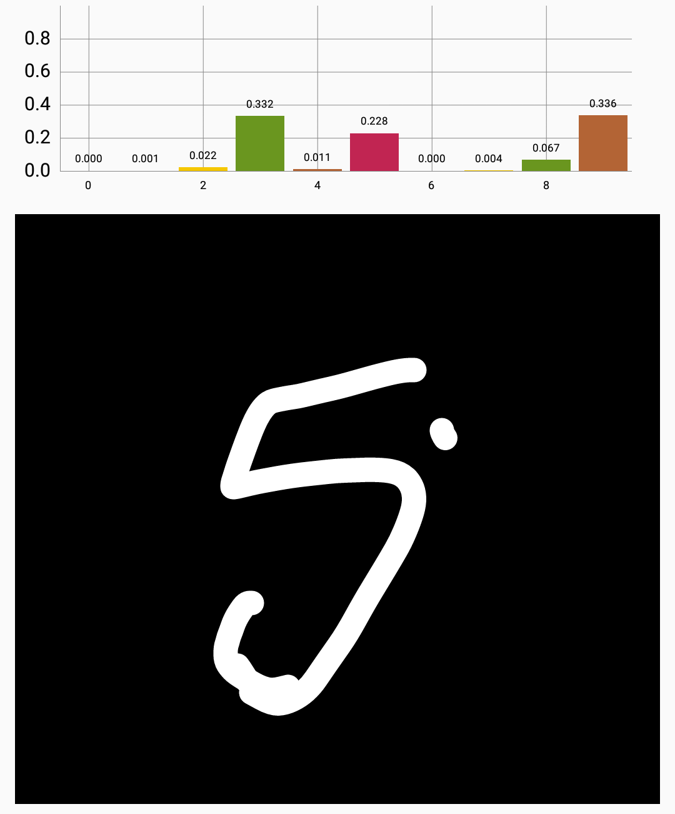
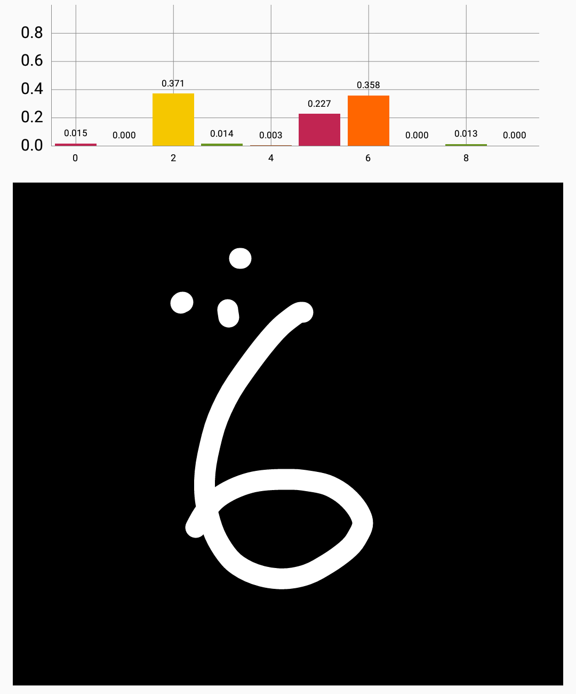
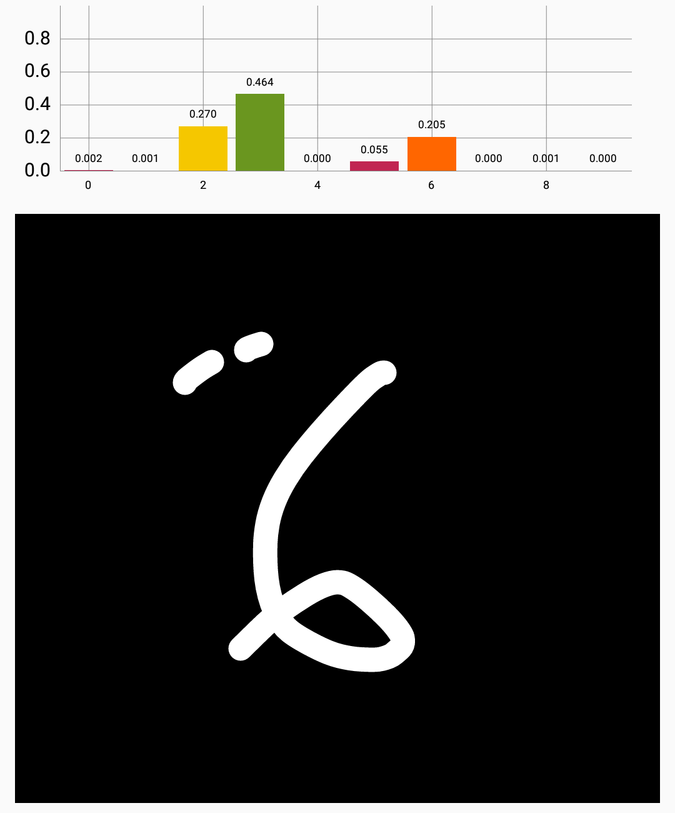
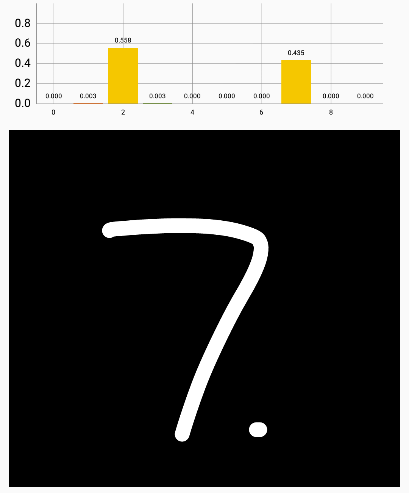
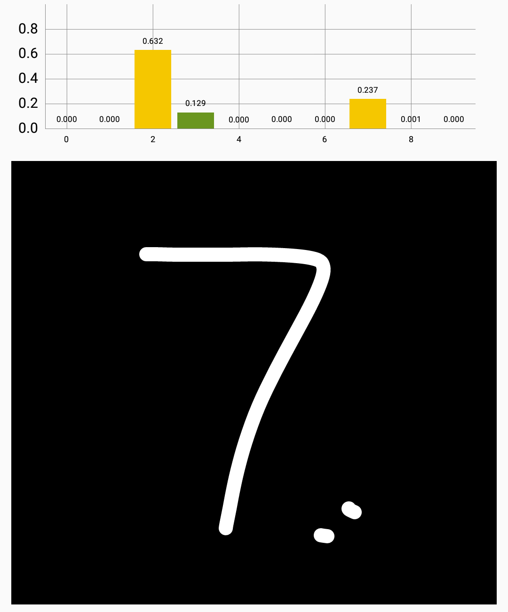
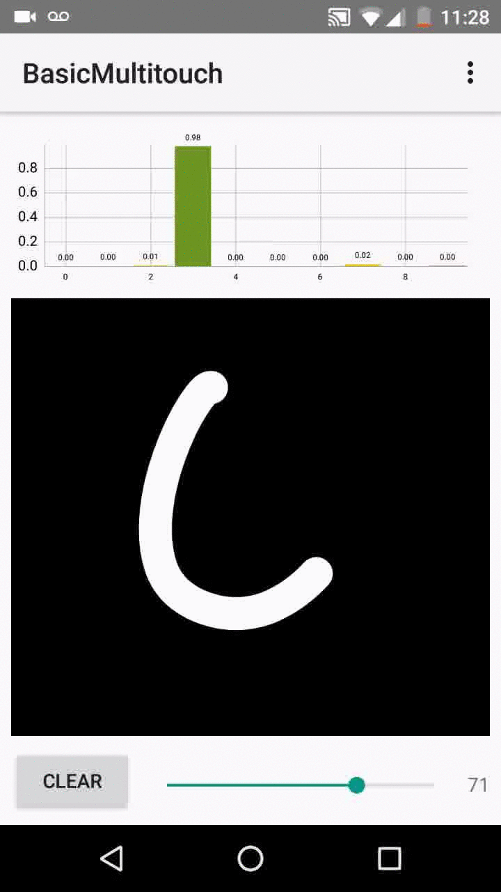

Human-Driven Black-Box Attacks in Android
===================================

A demo using TensorFlow-Lite that lets users hand draw their own targeted 
or untargeted black-box attacks against the Madry et al. (2018) models, 
which have been secured with PGD for perturbations bounded by 0.3 in the 
L_\infty threat model. We've replaced all variables with constants using the
pre-trained checkpoints <https://github.com/MadryLab/mnist_challenge>, 
frozen the graph, and exported to tflite format. 

Our concern is that since this defense is typically referred to as "state-of-the-art",
people may begin to deploy these models in real world applications under the impression
they must be secure. In **Adversarial Training Versus Weight Decay**, we argue that this
is a somewhat obscure threat model in practice. Using adversarial training with high-capacity
tends to confer robustness for one metric, but not others. This mobile app shows how a human
can fairly easily craft targeted attacks in the black-box setting (without access to the training
data, model architecture, parameters, etc). 

Toggle between the **naturally** trained and **public PGD** trained models with a menu in 
upper-right corner, and experiment with the brush stroke thickness and Hamming distance single-pixel-like
attacks to explore this model's vulnerabilities. Softmax probabilities refresh on finger lift. 

Pre-requisites
--------------

- Android SDK 27
- Android Build Tools v27.0.2
- Android Support Repository
- TensorFlow 1.6.x

Screenshots and Adversarial Examples
-------------

      

Getting Started
---------------

This sample uses the Gradle build system. To build this project, use the
"gradlew build" command or use "Import Project" in Android Studio.

Support
-------

If you've found an error in this sample, please file an issue.

Patches are encouraged, and may be submitted by forking this project and
submitting a pull request through GitHub.

Citation and Acknowledgements
-------

Thanks to Bradley Kennedy for pair-programming in the car on the way to Vector, and to Jonathan MacPherson for enthusiastically setting up the initial chart functionality.

This project is affiliated with **Adversarial Training Versus Weight Decay**, to appear on arXiv shortly:

Bibtex:  
```
@article{galloway2018adversarial,  
  title={Adversarial Training Versus Weight Decay},  
  author={Galloway, Angus and Tanay, Thomas and Taylor, Graham W},  
  journal={arXiv preprint arXiv:xxxx.XXXXX},  
  year={2018}  
}
```
